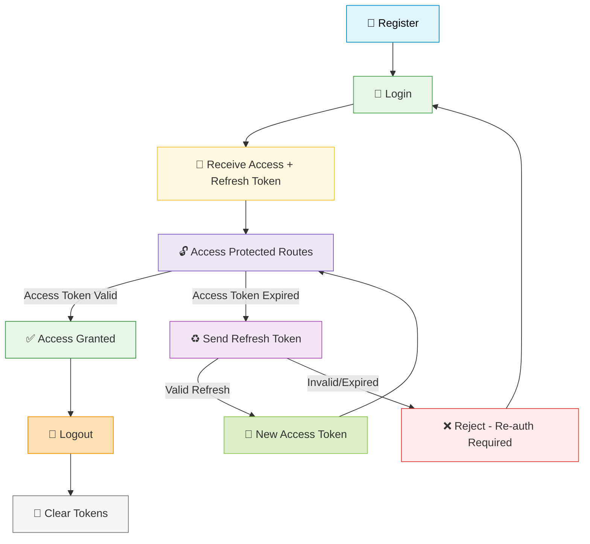

<div align="center">

# ⚔️ `inf-backend-template`
### * Backend Starter for Modern Web Apps

[](https://www.typescriptlang.org/)
[](https://nodejs.org/)
[](https://www.mongodb.com/)
[](https://www.docker.com/)
[](#-api-documentation)
[](LICENSE)

</div>

> 🧹 **A production-ready, modular backend template built with care** – by **`trhgatu`** – for any serious project.  
> 🧠 **Pre-configured Auth, RBAC, Logs, Upload, Realtime, CI, and more.**

---

## 🚀 Features at a Glance

| 🧩 Feature                     | 📋 Description                                  |
|-------------------------------|--------------------------------------------------|
| 🧽 Modular Architecture        | Feature-based structure, highly scalable        |
| 🔐 Auth (JWT)                 | Login, register, refresh, logout flows          |
| 🛡️ RBAC                      | Role-based access + permission guards           |
| 📍 Audit Logs                 | Auto-log admin actions with middleware          |
| 💾 MongoDB (Mongoose)         | Schema + model typing via Mongoose              |
| 🧠 Zod Validation              | Strong DTO validation with strict rules         |
| ☁️ Supabase Uploads           | Upload + serve images/files securely            |
| 🔌 Socket.IO                  | Real-time notifications & event system          |
| 🔍 Swagger Docs               | Auto-generated OpenAPI docs per module          |
| 🐳 Dockerized                 | Multi-stage build, small & efficient image      |
| 🔁 Multi-env CI/CD            | GitHub Actions: build, tag, deploy dev/prod     |
| 🛠️ GitHub Actions CI         | Auto lint/build/test on push (via workflows)    |
| 🧪 ESLint v9                  | Enforced strict typing – no `any`, no `console` |

---

## 📁 Project Structure

```
📦 trhgatu-inf-backend-template/
├── 🐳 Dockerfile
├── 🔧 docker-compose.yml
├── 📋 package.json
├── 🔐 .env.example
├── ⚙️ tsconfig.json
└── 📂 src/
    ├── 🚀 server.ts            # Entry point
    ├── 🏗️ app.ts               # App-level setup
    ├── 📂 config/              # DB, Redis, env configs
    ├── 📂 core/
    │   ├── 🛡️ middleware/      # Auth, logging, validation...
    │   ├── 🔧 utils/           # Logger, jwt, response helpers
    │   └── 📝 types/           # Express type overrides
    ├── 📦 modules/             # Feature-first modules
    │   └── (auth, user, role, ...) with controller, service, dto
    ├── 🛣️ routes/              # Main router
    ├── 🤝 shared/              # Enums, constants
    └── 🔌 socket/              # Socket.IO gateway
```

---

## 🛠️ Getting Started

<table>
<tr>
<td width="50%">

### 📥 **Installation**
```bash
# 1. Clone
git clone https://github.com/trhgatu/inf-backend-template.git
cd inf-backend-template

# 2. Install deps
npm install

# 3. Setup environment
cp .env.example .env
```

</td>
<td width="50%">

--- 

### 🏃‍♂️ **Development**
```bash
# Development Mode
npm run dev
# 🌐 Runs on http://localhost:3000

# Production Build
npm run build && npm start
```

</td>
</tr>
</table>

---

## 🐳 Dockerized Workflow

> ⚙️ **Requires `Docker` and `docker-compose`.**

<div align="center">

```bash
# 🚀 Quick Start with Docker
docker pull trhgatu/inf-backend-template:develop  # dev
docker pull trhgatu/inf-backend-template:main     # prod

docker-compose up -d --build
# 🎉 Visit: http://localhost:3000
```

</div>

---

**📋 Services Overview:**
- 🍃 **MongoDB**: exposed on port `27017`
- 🌐 **Backend**: port `3000`
- 💾 **Data volume**: persists MongoDB across reboots

---

## 🌍 Deployments

<div align="center">

| Environment | URL | Docker Tag | Status |
|:---:|:---:|:---:|:---:|
| 🧪 **Develop** | [`inf-backend-template-develop.onrender.com`](https://inf-backend-template-develop.onrender.com) | `develop` | [](https://hub.docker.com/r/trhgatu/inf-backend-template/tags) |
| 🚀 **Production** | [`inf-backend-template-prod.onrender.com`](https://inf-backend-template-prod.onrender.com) | `main` | [](https://hub.docker.com/r/trhgatu/inf-backend-template/tags) |

</div>

---

## 🔐 Auth Flow (JWT)

<div align="center">



</div>

---

**🛣️ Available Endpoints:**
- `POST /auth/register` 📝
- `POST /auth/login` 🔑
- `GET /auth/me` 👤 *(Protected)*
- `POST /auth/refresh-token` 🔄
- `POST /auth/logout` 🚪

---

## 🧱 Key Modules

<div align="center">

| Module | Description | Features |
|:---:|:---:|:---:|
| 🔐 **`auth`** | JWT login/register + refresh flow | Login, Register, Refresh, Logout |
| 👤 **`user`** | User profile & status | Profile, Settings, Status |
| 🎭 **`role`** | Role CRUD + permission binding | RBAC, Permissions, Guards |
| 🔑 **`permission`** | System-wide permission rules | Access Control, Route Guards |
| 📋 **`log`** | Audit trail middleware | Activity Tracking, History |
| 📤 **`upload`** | Supabase file/image upload | File Storage, Image Processing |
| 🔌 **`socket`** | Real-time event system | WebSocket, Live Updates |
| 🎨 **`__template__`** | For generating new modules fast | Code Generation, Scaffolding |

</div>

---

## 📚 API Documentation

<div align="center">

### 📖 **Auto-generated Swagger UI** – instantly reflects your routes and DTOs.

| Environment | URL | Status |
|:---:|:---:|:---:|
| 🧪 **Local Dev** | [`http://localhost:3000/api-docs`](http://localhost:3000/api-docs) | 🟢 |
| 🌿 **Develop** | [`https://inf-backend-template-develop.onrender.com/api-docs`](https://inf-backend-template-develop.onrender.com/api-docs) | 🟢 |
| 🚀 **Production** | [`https://inf-backend-template-prod.onrender.com/api-docs`](https://inf-backend-template-prod.onrender.com/api-docs) | 🟢 |

> 💡 **Each module is responsible for its own Swagger definitions & schema DTOs** – making docs fully modular and maintainable.

</div>

---

## 🔐 .env Variables

<table>
<tr>
<td width="50%">

### ⚙️ **Core Settings**
```env
PORT=3000
MONGODB_URI=mongodb://mongo:27017/inf-template
JWT_SECRET=your_secret
```

</td>
<td width="50%">

### ☁️ **Supabase Storage**
```env
SUPABASE_URL=https://xyz.supabase.co
SUPABASE_SERVICE_ROLE_KEY=your_key
```

</td>
</tr>
</table>

---

## 📦 Scripts

<div align="center">

| Command | Description | Usage |
|:---:|:---:|:---:|
| 🏃‍♂️ **`npm run dev`** | Start with ts-node-dev | Development |
| 🏗️ **`npm run build`** | Compile to `/dist` | Production Build |
| 🚀 **`npm start`** | Run production build | Production |
| 🌱 **`npm run seed`** | Seed database | Data Setup |
| ⚡ **`npm run generate`** | Generate new module via CLI script | Code Generation |
| 🧹 **`npm run lint`** | Run ESLint with strict config | Code Quality |

</div>

---

<div align="center">

## ⚖️ License

**MIT License** © [@trhgatu](https://github.com/trhgatu) – use it, build on it, and make it your own.

---

### 🔥 **Build systems that reflect your soul.**

> This isn't just a template – it's your backend battleground.  
> **Let's craft something extraordinary.**
